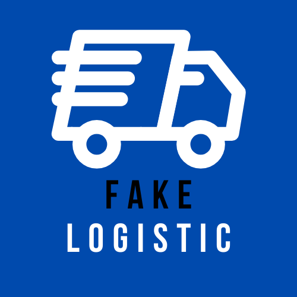
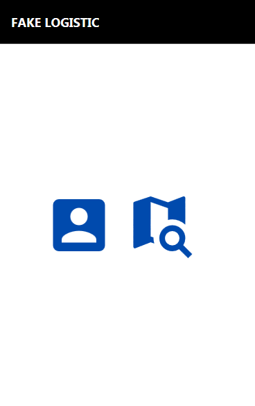
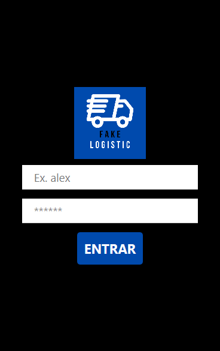
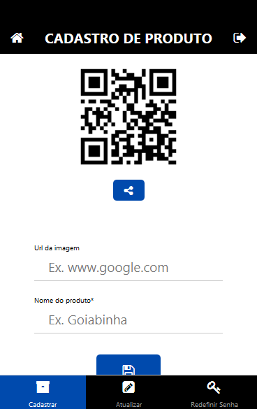
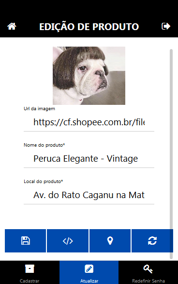
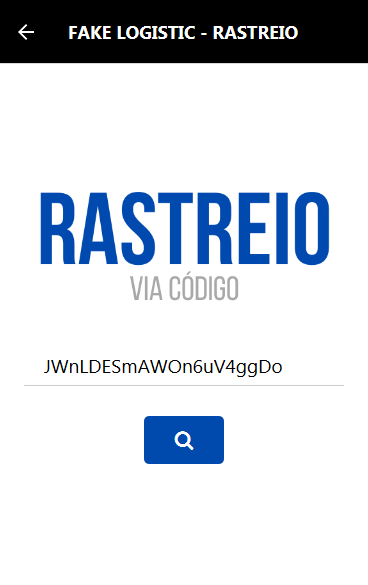
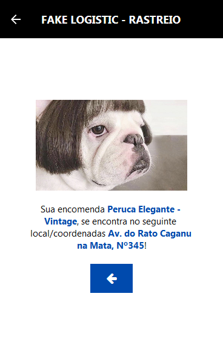

<h1 align="center" id="title">FAKE LOGISTIC</h1>
<!-- Logo -->
<p align="center">
  
</p>


<!-- Título&Descrição -->
<h2 align="left" id="descricao">Descrição</h2>
<p align="justify">Esta é uma aplicação mobile bem simples, desenvolvida com fins de estudo e aprendizado, realiza o cadastro de produtos e gera o código de rastreio e seu QRCode, para facilitar ainda mais. É possível a edição do produto, identificado pelo código que é gerado e estabelecer sua nova localização ou mesmo defini-lo como "entregue" (delete). Tais funcionalidades como o administrador do sistema, enquanto usuário é apenas possível utilizar o código de seu produto e realizar o rastreio.</p>


<!-- Shields -->
<p>
	</img>
  </img>
    </img>
    <!--</img>-->
    </img>
</p>


<!-- Screenshots -->
<h2 align="left" id="screenshots">Screenshots</h2>
<p align="center">
  
  
  
</p>
<p align="center">
  
  
  
</p>


<!-- Tecnologias -->
<h2 align="left" id="tecnologias">Tecnologias</h2>

As seguintes ferramentas foram usadas na construção do projeto:

- [Expo](https://expo.io/)
- [Node.js](https://nodejs.org/en/)
- [React Native](https://reactnative.dev/)
- [MySQL](https://www.mysql.com/)


<!-- Pré-Requisitos -->
<h2 align="left" id="pre">Pré-Requisitos</h2>

Antes de começar, você vai precisar ter instalado em sua máquina as seguintes ferramentas:
[Expo](https://docs.expo.dev/get-started/installation/), [Node.js](https://nodejs.org/en/), particularmente indico juntamente o módulo [nodemon](https://www.npmjs.com/package/nodemon) para cuidar da parte dos SQLs e etc. e finalmente o MySQL que no caso foi utilizado o [phpMyAdmin](https://www.phpmyadmin.net/) como gerenciador do banco de dados. É bacana você possuir um editor para trabalhar com o código, fica a dica o [VSCode](https://code.visualstudio.com/).


<!-- Features -->
<h2 align="left" id="features">Funcionalidades</h2>

- [x] Login do Administrador;
- [x] Logout do Administrador;
- [x] Cadastro de Produtos;
- [x] Gerador de QRCode automático para rastreio;
- [ ] Edição com o QRCode;
- [x] Edição do Produto;
- [x] Redefinição de Senha;
- [ ] Rastreio com o QRCode;
- [x] Rastreio do Produto;


<!-- Executando o app -->
<h2 align="left" id="run">Rodando a aplicação (web)</h2>

```bash
# Clone este repositório
$ git clone https://github.com/IN0C3NC10/FakeLogistic.git

# Abra a pasta no seu VSCode ou editor de preferência

# Instale os pacotes necessários p/ execução com
$ npm install

# Agora vamos adaptar o projeto para o seu banco de dados, vá em "/config/config.json"...
# Então, altere os dados do "development" para suas configurações

# Agora vamos tratar do banco, execute inicialmente o comando para gerar as tabelas
$ npx sequelize-cli db:migrate

# Como estamos falando de um sistema bem simplificado, não temos um Cadastro (ainda)...
# Sendo assim, utilize o comando abaixo para gerar nosso usuário padrão para o sistema, via uma seeder (username: adm - password:1234)
$ npx sequelize-cli db:seed:all

# Sensacional, agora execute o projeto com
$ npm run web
# ou via Expo (tanto faz)
$ expo start --web

# Para o backend, abra outro terminal e execute
$ nodemon Controller

#DoItUrWay
# Caso deseje utilizar outro banco de dados, ou mesmo alterar a localização padrão, é facil...
# Vá ao dir "/config/config.json"...
#   Para o banco, substitua em "development" os dados do seu banco de dados;
#   Para a localização, substitua em "origin" o novo local.

#BeHappy!
```
<!-- Autor -->
<h2 align="left" id="autor">Autor</h2>
<p>
	<a href="https://github.com/IN0C3NC10">
		
	</a>
	<br />
	Feito com ❤️ por <strong>Bruno Inocencio</strong>!
</p>

<p align="left">
  <!-- Outlook -->
  <a href="mailto:bruno.inocencio@fatec.sp.gov.br" alt="Outlook" target="_blank">
    
  </a>
  <!-- Linkedin -->
  <a href="https://cutt.ly/nQlVjQV" alt="Linkedin" target="_blank">
    
  </a>
  <!-- GitHub -->
  <a href="https://github.com/IN0C3NC10" alt="GitHub" target="_blank">
    
  </a>
</p>
